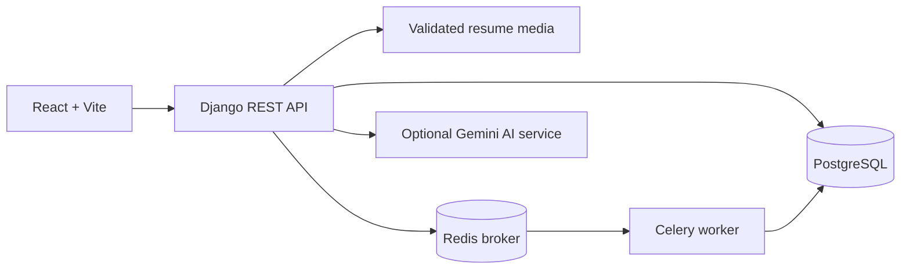
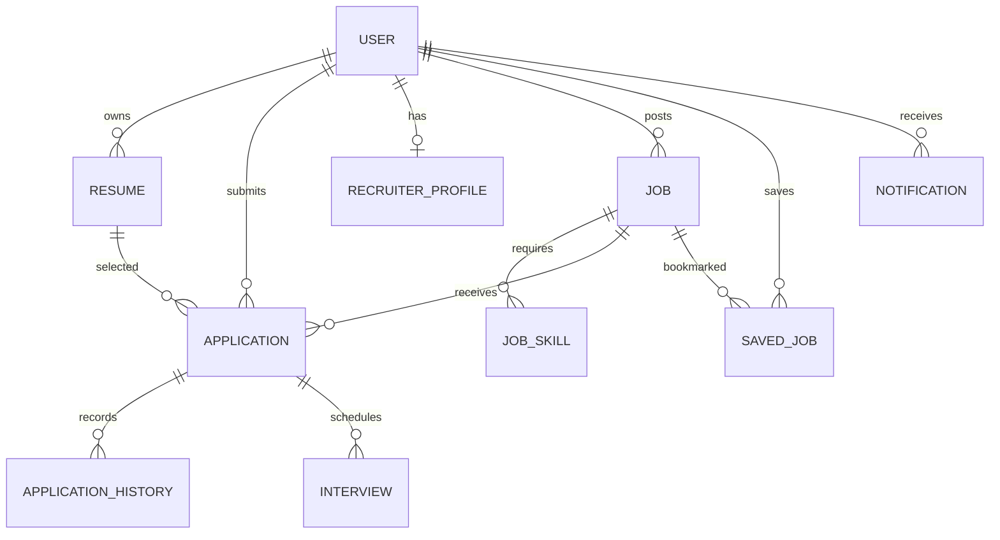

# ResumeAI Architecture

## Runtime topology

## Domain boundaries

- `users`: custom authentication, roles, recruiter company profiles.
- `resumes`: uploads, PDF/DOCX parsing, structured extraction, ATS scoring.
- `jobs`: public published marketplace, recruiter-owned postings, required/preferred skills.
- `matching`: skill overlap and semantic similarity scoring.
- `applications`: candidate submissions, stored match evidence, recruiter status workflow, audit history.
- `engagement`: saved jobs, recommendations, notifications, interviews, Celery refresh task.
- `ai`: isolated LLM prompts and fallback behavior.

## Core relationships

## Important API groups

- Auth: `/api/auth/register/`, `/api/auth/login/`, `/api/auth/refresh/`, `/api/auth/profile/`
- Resumes: `/api/resumes/`, `/api/resumes/upload/`, `/api/resumes/<id>/analysis/`
- Jobs: `/api/jobs/`, `/api/jobs/<id>/`
- Matching: `/api/matching/<resume_id>/`, `/api/matching/<resume_id>/<job_id>/`
- Applications: `/api/applications/`, `/api/applications/my/`, `/api/applications/recruiter/`, `/api/applications/<id>/status/`
- Engagement: `/api/engagement/saved-jobs/`, `/api/engagement/recommendations/`, `/api/engagement/notifications/`, `/api/engagement/interviews/`

## Background processing

Redis and Celery are included in Docker Compose. `engagement.tasks.refresh_recommendations` is the first asynchronous task boundary. Resume parsing and AI calls can move to Celery using the same pattern without changing API contracts.

## Security boundaries

- Public registration accepts only candidate or recruiter roles; admin assignment remains administrative.
- Recruiters can manage only jobs they own and applications received by those jobs.
- Candidates can submit only their own processed resumes.
- Resume download uses `/api/applications/<id>/resume/` and checks candidate, owning recruiter, or admin authorization.
- Matching, ATS scores, and recommendations are application-generated guidance, not automated hiring decisions.
